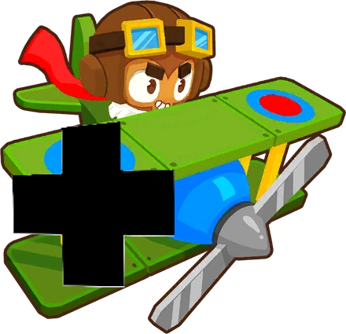

<h1 align="center">Monkey Ace</h1>

### Downloads

<h1 aling="left"></h1>

## Read Me

Hey Everyone This is my First Ever BTD6 Mod

Thank You To DarkTerraYT for Gettting Me into Modding! Go subscribe to him!

This WILL be updated

If you want to join my discord the link is here: https://discord.gg/hCgP22JNYA

This Mod is Still in Alpha so only 2 tiers per path are availible

Please, Give Feedback

Anyways, Thanks For Reading and Have A Lovely Year

Bye

## Plans

Make New Gamemodes, Bloons and Roundsets (New Mod) - This Will take the longest

Finish Teir 3 - 5

Add some more paths using Paths ++

Add a Paragon

Add new Visuals and Models

And More

